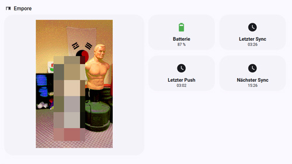

# 📖 Table of content

- [📖 Table of content](#-table-of-content)
- [Features](#features)
- [🧩 Requirements](#-requirements)
- [📦 Installation](#-installation)
  - [Option A: Installation via HACS (recommended)](#option-a-installation-via-hacs-recommended)
  - [Option B: Manual installation](#option-b-manual-installation)
- [Configuration](#configuration)
  - [How to get your PAPER\_ID and DEVICE\_ID (using the web application)](#how-to-get-your-paper_id-and-device_id-using-the-web-application)
  - [How to get your PAPER\_ID and DEVICE\_ID (using cURL)](#how-to-get-your-paper_id-and-device_id-using-curl)
  - [configuration.yaml](#configurationyaml)
  - [Folder Setup](#folder-setup)
    - [Input directory](#input-directory)
    - [Publish directory (optional)](#publish-directory-optional)
- [Entities](#entities)
  - [Sensor](#sensor)
    - [State:](#state)
    - [Attributes:](#attributes)
- [Services](#services)
- [Automation Examples](#automation-examples)
  - [Upload twice per day:](#upload-twice-per-day)
  - [Run dynamically shortly before next frame sync](#run-dynamically-shortly-before-next-frame-sync)
- [Device Telemetry](#device-telemetry)
  - [Telemetry sensors](#telemetry-sensors)
  - [Manual refresh (optional)](#manual-refresh-optional)
  - [Battery percentage calculation](#battery-percentage-calculation)
  - [Example for a Home Assistant dashboard integration](#example-for-a-home-assistant-dashboard-integration)
- [Troubleshooting](#troubleshooting)
  - [Upload succeeds but frame shows old image](#upload-succeeds-but-frame-shows-old-image)
  - [Blocking calls in logs](#blocking-calls-in-logs)
- [Roadmap / Ideas](#roadmap--ideas)
- [Support / Issues](#support--issues)
- [License](#license)
- [🙏 Note](#-note)

# Features

A small Home Assistant custom integration to **upload images from the Home Assistant server to a paperlesspaper e-paper frame** using the WireWire API. The integration is designed to work well with Home Assistant automations (e.g. upload a new image twice a day), and provides a *“varied random”* image selection that avoids repeating the same images too often.

- Upload a random image from an input folder to a paperlesspaper frame via API
- "Varied random" selection:
  - remembers recently used images
  - recent-window size = **50% of available images** (min 5, max 50)
  - avoids repetition until the pool is exhausted
- Optional publish/copy of the selected image into `/config/www/...` for preview/debugging
- Optional cleanup of the publish directory before publishing
- Robust upload retries with exponential backoff
- Gets device information like battery level and last update
- Home Assistant sensors showing:
  - last upload timestamp
  - current file name
  - last result (success/failed/dry_run)
  - last HTTP status / error
  - battery level / percentage
  - last update

# 🧩 Requirements

- Home Assistant **2024.12** or newer. I personally always work on the current version of Home Assistant, so I cannot guarantee compatibility with older versions.
- Your Home Assistant server needs internet access to connect to the paperlesspaper cloud service. paperlesspaper does not provide an offline service (yet).
- The images to be retrieved have to be available on the Home Assistant server, optimized for the frame, which means: in the correct resolution (800x480px for the 7" frame), in PNG format, and already adjusted for the Spectra 6 display. In my setup, I synchronize the images from a local [Immich](https://immich.app/) server and then optimize them automatically. I wrote separate scripts for this, which I will post on GitHub when I get a chance. I already published my optimizer using paperlesspaper's EPD Optimizer [here](https://github.com/fwmone/eink-optimize), which works quite well.
- The images must be in <input_dir> (see configuration below). Use PNGs for best results, but JPEGs are also possible.

# 📦 Installation

## Option A: Installation via HACS (recommended)

1. Open **HACS → Integrations**
2. Click on **“Custom Repositories”**
3. Add this repository: https://github.com/fwmone/paperlesspaper_push, Category: **Integration**
4. Install **paperlesspaper Push**
5. Restart Home Assistant

## Option B: Manual installation

1. Download this repository
2. Copy the custom_components/paperlesspaper_push folder to: <config>/custom_components/paperlesspaper_push (this is usually /config)
3. Restart Home Assistant

# Configuration

Please follow the steps for [generating an API key](https://paperlesspaper.de/posts/api). 

## How to get your PAPER_ID and DEVICE_ID (using the web application)
After creating the API key, stay logged in the [web application](https://web.wirewire.de). In the lefthand menu, click "Devices" (Geräte) and then your frame. Your browser should now show a URL like this: ```https://web.wirewire.de/6963a0955ded783d12f68bd0/devices/692305173fd4bbc4a8741b43/```. The string ```692305173fd4bbc4a8741b43``` (after /devices/) is YOUR_DEVICE_ID. If you have not already done so, click "Current" (Aktuell) in the lefthand menu and upload a new picture. This automatically creates a paper. After doing so, choose "Library" (Bibliothek) and click the first picture. An editor should open and your browser's URL should show a URL like this ```https://web.wirewire.de/6963a0955ded783d12f68bd0/library/device/692305173fd4bbc4a8741b43/6987a14a51fd56e10cf43d14```. The string ```6987a14a51fd56e10cf43d14``` is YOUR_PAPER_ID.

## How to get your PAPER_ID and DEVICE_ID (using cURL)

If you're familiar with cURL and JSON, do this:

1. Retrieve your organization id: ```curl https://api.memo.wirewire.de/v1/organizations/ -H "x-api-key: YOUR_API_KEY"```. 
2. Retrieve your device id and paper id: ```curl https://api.memo.wirewire.de/v1/devices?organization=YOUR_ORGANIZATION_ID -H "x-api-key: YOUR_API_KEY"```. The result contains the keys "id" which is YOUR_DEVICE_ID (do *not* use "deviceId") and "paper" which is YOUR_PAPER_ID.

## configuration.yaml

This integration currently uses YAML configuration.

Add this to your `configuration.yaml`:

```yaml
paperlesspaper_push:
  api_key: !secret paperlesspaper_api_key
  paper_id: "YOUR_PAPER_ID"
  device_id: "YOUR_DEVICE_ID"

  # optional:
  base_url: https://api.memo.wirewire.de/v1
  input_dir: /media/picture-frames/paperlesspaper
  publish_dir: /config/www/picture-frames/paperlesspaper
  timeout: 30
  max_attempts: 4
  publish: true
```

Add the secrets to secrets.yaml:

```yaml
paperlesspaper_api_key: "YOUR_API_KEY"
```

Restart Home Assistant after changing YAML.

## Folder Setup
### Input directory

Place frame-optimized (800x480px for 7", optimized colors - get optimization script [here](https://github.com/fwmone/eink-optimize)) images in ```/media/picture-frames/paperlesspaper``` (or whatever folder you have configured). 

Supported formats:
- .png (use that for best results)
- .jpg / .jpeg

### Publish directory (optional)

If enabled, the integration copies the chosen image to: ```/config/www/picture-frames/paperlesspaper```.

This is useful for debugging or previewing the selected image from Home Assistant (served under /local/...).

# Entities
## Sensor

```sensor.paperlesspaper_push_status```

### State:

- never or last upload timestamp (UTC ISO format)

### Attributes:

- current_filename
- last_result
- last_http_status
- last_error
- published_name

# Services
```paperlesspaper_push.upload_random```

Uploads a (varied) random image.

Example:

```yaml
service: paperlesspaper_push.upload_random
data:
  dry_run: false
  publish: true
```

Fields:
- dry_run (bool, optional): select/publish only, do not upload
- publish (bool, optional): publish/copy the chosen file to publish_dir
- force_file (string, optional): force a specific file name from the input folder

```paperlesspaper_push.reset_recent```

Clears the internal "recent images" history list.

Example:

```yaml
service: paperlesspaper_push.reset_recent
```

# Automation Examples

## Upload twice per day:

```yaml
alias: Paperlesspaper Upload Morning
trigger:
  - platform: time
    at: "05:45:00"
action:
  - service: paperlesspaper_push.upload_random
    data:
      publish: true
      dry_run: false
```

---

```yaml
alias: Paperlesspaper Upload Afternoon
trigger:
  - platform: time
    at: "16:45:00"
action:
  - service: paperlesspaper_push.upload_random
    data:
      publish: true
      dry_run: false
```

## Run dynamically shortly before next frame sync

For whatever reason, wake up time periods are not precise. So are 12h in reality about 11:50h. Because of that, I created a dynamic upload using the ```paperlesspaper_push_next_device_sync``` sensor:

```yaml
alias: "paperlesspaper: Upload"
description: ""
triggers:
  - value_template: >
       
        {{ as_timestamp(next) - 30*60 <= now().timestamp() }}
      
        false
      
    trigger: template
conditions:
  - condition: template
    value_template: >
       
        {{ now().timestamp() - as_timestamp(last) > 3600 }}
      
        true
      
actions:
  - action: paperlesspaper_push.upload_random
    data:
      publish: true
      dry_run: false
```

# Device Telemetry

In addition to upload/push functionality, the integration can poll the paperlesspaper API for **device telemetry** (battery, timestamps, sync state).

The integration will periodically call ```GET /v1/devices/<device_id>``` and update the related sensors.

## Telemetry sensors

When device_id is configured, the following sensors are created:

- Battery
  - sensor.paperlesspaper_push_battery_voltage (V)
  - sensor.paperlesspaper_push_battery (%)

- Timestamps
  - sensor.paperlesspaper_push_last_reachable
  - sensor.paperlesspaper_push_next_device_sync
  - sensor.paperlesspaper_push_updated_at
  - sensor.paperlesspaper_push_loaded_at

Note: The API exposes batLevel as a raw value (typically millivolts for 4×AAA in series).
The integration converts it to a percentage using a pragmatic min/max voltage model.

## Manual refresh (optional)

You can trigger an immediate telemetry refresh via the service:
```paperlesspaper_push.refresh_device```

## Battery percentage calculation

Battery percentage is derived from the reported raw battery voltage (`batLevel`).

Default mapping (4×AAA in series):
- 6.4 V → 100%
- 4.8 V → 0%

Values are clamped to the range and mapped linearly in between. So, yes, when using rechargeable NiMH batteries, the mapping is likely to show never 100%. Haven't tested it yet.

## Example for a Home Assistant dashboard integration



Shows last pulled image, battery value and last pull time. I use the super handy [button cards](https://github.com/custom-cards/button-card), that need to be installed beforehand.

```yaml
type: grid
cards:
  - type: heading
    icon: mdi:coat-rack
    heading: Diele
    heading_style: title
  - type: markdown
    content: |-
      
    card_mod:
      style: |
        ha-card { 
          text-align: center; 
        }
  - type: custom:layout-card
    layout_type: grid
    layout:
      grid-template-columns: 1fr 1fr
      grid-gap: 6px
      margin: "-8px 0 0 0;"
      card_margin: 0 0 0 0;
    cards:
      - type: custom:button-card
        entity: sensor.bloomin8_battery
        name: Batterie
        show_state: true
        show_label: true
        layout: icon_name_state2nd
        styles:
          icon:
            - height: 32px
          card:
            - border-radius: 28px
            - padding: 10px
            - height: 110px
          grid:
            - grid-template-areas: "\"i\" \"n\" \"s\""
            - grid-template-columns: 1fr
            - grid-template-rows: 1fr min-content min-content
          name:
            - justify-self: center
            - font-weight: bold
            - font-size: 0.9em
          state:
            - justify-self: center
            - font-size: 12px
            - padding-top: 1px
        tap_action:
          action: more-info
      - type: custom:button-card
        entity: sensor.bloomin8_letzter_pull
        name: Letzter Pull
        show_state: true
        show_label: true
        layout: icon_name_state2nd
        styles:
          icon:
            - height: 32px
          card:
            - border-radius: 28px
            - padding: 10px
            - height: 110px
          grid:
            - grid-template-areas: "\"i\" \"n\" \"s\""
            - grid-template-columns: 1fr
            - grid-template-rows: 1fr min-content min-content
          name:
            - justify-self: center
            - font-weight: bold
            - font-size: 0.9em
          state:
            - justify-self: center
            - font-size: 12px
            - padding-top: 1px
        tap_action:
          action: more-info
column_span: 2

# API / Upload Method

The upload is performed using a multipart form-data request similar to:

```bash
curl -X POST "https://api.memo.wirewire.de/v1/papers/uploadSingleImage/<PAPER_ID>" \
  -H "x-api-key: <API_KEY>" \
  -F "picture=@/path/to/image.png;type=image/png"
```

# Troubleshooting
## Upload succeeds but frame shows old image

The Paperlesspaper frame pulls images from the cloud in configurable intervals.
Make sure the device is configured to wake up and fetch images.

## Blocking calls in logs

This integration avoids blocking filesystem operations inside the event loop by using Home Assistant's executor helpers.

If you still see blocking call warnings, please open an issue with logs.

# Roadmap / Ideas
- Config Flow (UI-based configuration)
- Additional sensors (e.g. success/failure binary sensor)
- Optional "keep last N published images" instead of cleaning publish_dir fully
- Support multiple Paper IDs

# Support / Issues

Please open issues on GitHub if you encounter bugs or have feature requests.

# License

This project is licensed under the terms of the MIT License.

# 🙏 Note

This integration has no official connection to the manufacturer of paperlesspaper frames.